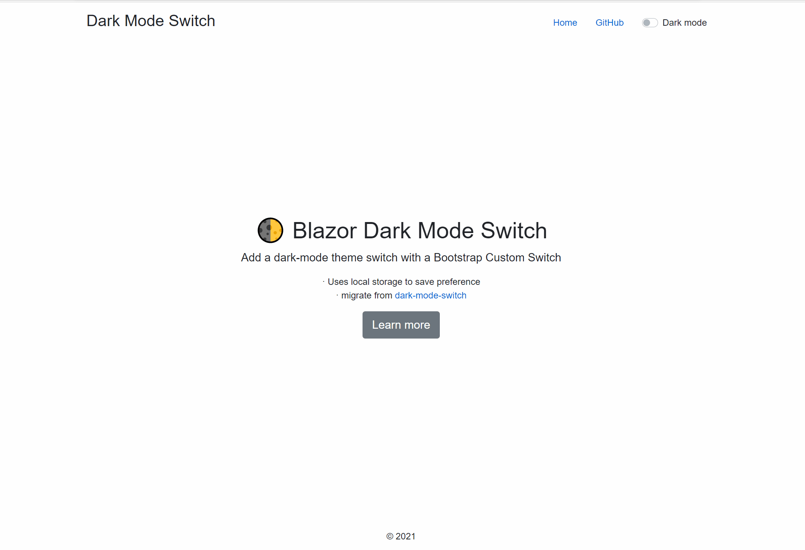

# 🌓 Blazor Dark Mode Switch

A Copy of [Dark mode switch](https://github.com/coliff/dark-mode-switch)
Add a dark-mode theme toggle with a Bootstrap Custom Switch.

- Uses local storage to save preference
- You can fork it and custom personalized style.

## gifs

